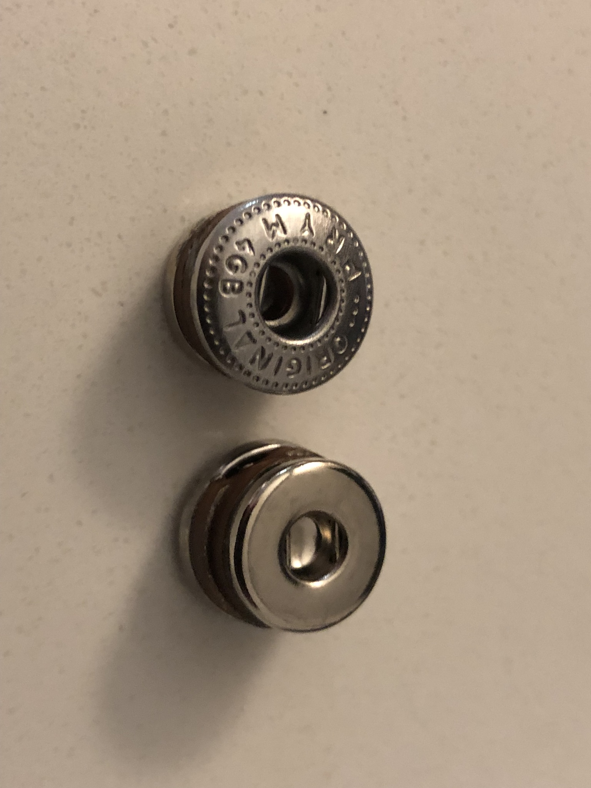
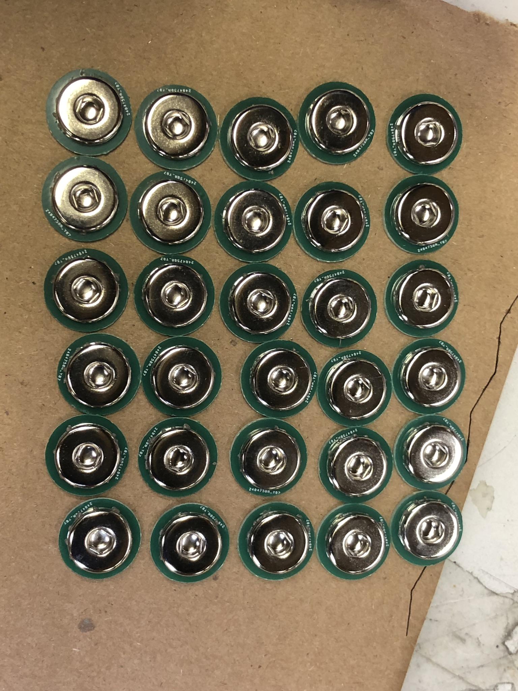
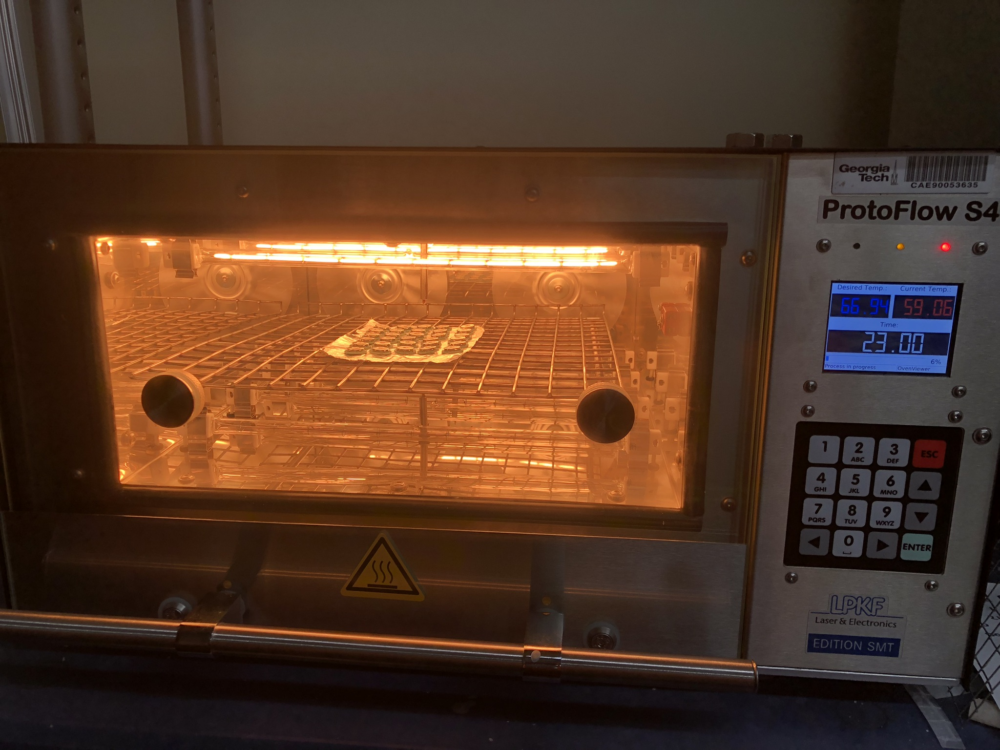
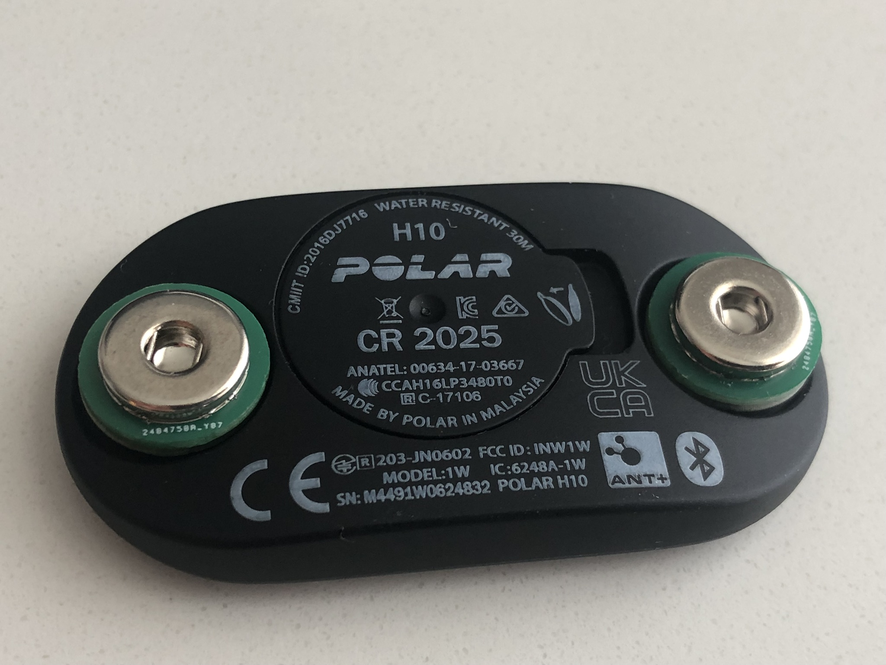
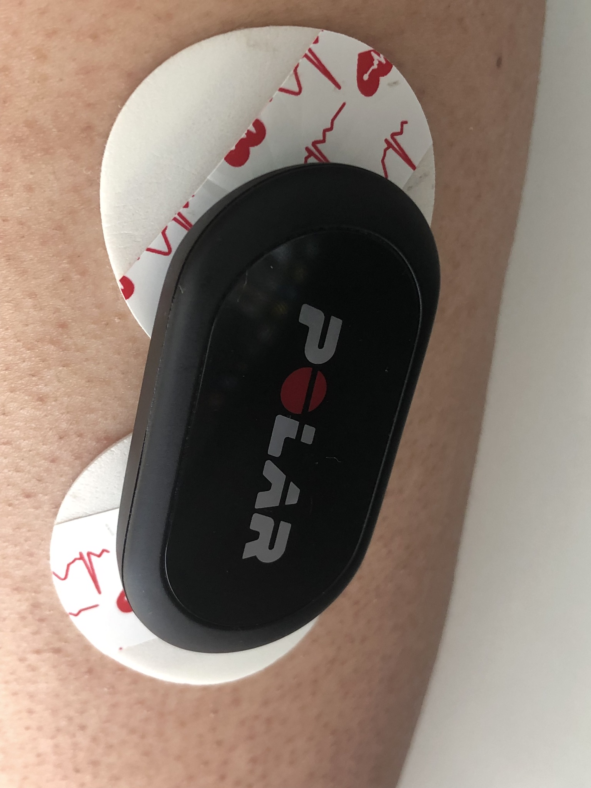
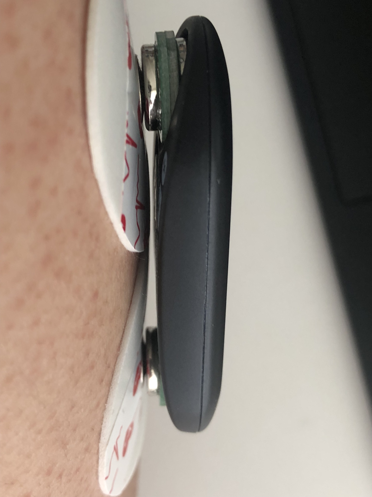

# polar-h10-visualizer

A real-time physiological data visualizer and streaming pipeline. This is a tool designed to support teaching physiological data acquisition, processing, and visualization. The system acquires data (ECG, Accelerometer, Respiration Force, and Breathing Rate) in the browser via Web Bluetooth and the Vernier Go Direct API, archives it locally as structured Apache Arrow files, and streams it instantly into Lab Streaming Layer (LSL) via a local WebSocket bridge. Supports sending keyboard trigger signal for running simple physiological data accquisition study. See it in action [here](https://yhzhao343.github.io/polar-h10-visualizer/)

## Sneak Peek


## Using Polar H10 to get surface EMG data

You can retro-fit a Polar H10 to make it connect to a standard electrode. Then, you can stick it on your body and use it as a surface EMG sensor. Align your modified Polar H10 with the direction of the muscle fibers to get the best signal.

|       |       |       |
| :---: | :---: | :---: |
|  |  | |
|   prym button to ECG socket             |  Assemble and paste the Adapters   | Bake in reflow oven|
| |     | |
|   Fit Polar-H10 with adapters                    |  Add ECG pad and put on skin (top) | Add ECG pad and put on skin|


## Full Video Demo
[](https://youtu.be/kCUuH8LL9HA)

## Project Structure
```
.
├── build/                           # Compiled frontend web assets
├── server_side
│   ├── lsl_bridge/                  # Real-time WebSocket-to-LSL daemon
│   │   ├── lsl_bridge.js
│   │   └── package.json
│   └── arrow_to_lsl_replay/         # Session archive replay player
│       ├── replay_arrow.js
│       └── package.json
├── src/                             # TypeScript frontend source code
└── package.json                     # Frontend build configurations
```

## Installation & Build

If you just want to visualize the data, and record the data as `Apache Arrow` files and `.csv` files, you don't need to install anything. You can just go to the [Github page](https://yhzhao343.github.io/polar-h10-visualizer/) to use the tool in your latest chrome browser. If you need lsl restreaming of the data obtained from the webpage in realtime. Or need to replay the recorded `Apache Arrow` file as lsl streams, then follow the steps below to setup your system.

### 0. Node.js install

#### Linux/Mac Setup:

Recommend using `nvm` to set up and install node.js ([link](https://github.com/nvm-sh/nvm)). Follow the installation guide in the link. Refresh or restart your shell after the install, and then install the latest Long-Term Support (LTS) version of node.js:

```Bash
nvm install --lts
nvm use --lts
```

#### Windows Setup:
Windows uses a separate, native implementation called nvm-windows ([link](https://github.com/coreybutler/nvm-windows/releases)). Follow the installation guide in the link.


```powershell
nvm install lts
nvm use lts
```

Note: The first time you run nvm use, Windows may prompt you with a User Account Control (UAC) pop-up to approve the creation of the dynamic Node symlink.


### 1. Frontend Setup

From the project root directory:

```Bash
npm install
npm run build      # Compiles assets into the build/ folder
```

To run the frontend in development mode with hot-reloading:

```Bash
npm run dev
```

### 2. Real-Time LSL Bridge Setup

Navigate to the bridge directory to install its dedicated dependencies:

```Bash
cd server_side/lsl_bridge
npm install
```

### 3. Replay Utility Setup

Navigate to the replay utility directory to install its dependencies:

```Bash
cd server_side/arrow_to_lsl_replay
npm install
```

## User Operations Guide

### Step 1: Start the Real-Time LSL Server
Before opening the web interface, spin up the backend server so LSL streams can be initialized instantly when toggling sensors:

```Bash
cd server_side/lsl_bridge
node lsl_bridge.js
```

Leaves an active daemon listening on `ws://localhost:8765`. It handles metadata registration and pushes streams automatically onto your local LSL network.

### Step 2: Acquire and Stream Live Data

 1. Launch the web interface (via npm run dev or by serving the build/ folder).

 2. Open the page in a Chromium-based browser (Chrome, Edge) with Bluetooth enabled.

 3. Click Connect Polar H10 or Connect Vernier Respiration Belt in the top-left toolbar to pair your hardware.

 4. Flip the EXG, ACC, Force, or Resp switch on any connected sensor row.

    - Data immediately streams to the canvas visualizer and broadcasts over your network via LSL.

### Step 3: Record Sessions to Disk

 1. Click the Folder Icon in the top-right menu to select a local directory. Grant the browser file write permissions when prompted.

 2. Configure your session metadata (Study, Subject, Session) in the top bar text fields.

 3. Click the Record Button (circle icon) to begin archiving.

 4. Click it again to stop. The system flushes the data, dumps a master metadata.json packet, and automatically generates matching `.arrow` and `.csv` files inside a timed folder block.

## Usage Tips

 1. After you select the bodypart for a sensor, you will notice that the url parameter is changed. If you use this new utl next time, after you connect to a sensor, the bodypart is automatically selected for you based on the url parameter.

 2. In a clean RF environment, the system can support visualizing 7 polar-h10 sensor data streams (both ECG and Accelerometer) without too much issue on a recent computer.

 3. The system is specifically designed to support adding the same sensor as different rows. This could be useful for teaching. For example,
  - you can show the effect of two different filter parameters on the same time-series data.
  - you can have the 1st row only show the ECG data, the 2nd row only show the Accelerometer data, and see the electrical signal of the heart (ECG) align with the vibration signal cause by the heart (ECG).

 4. The heart rate and heart rate variability rate measures only shows up if you select the bodypart as heart.

## Replaying Saved Sessions

To simulate live data acquisition or run offline analysis pipelines using previously recorded data, execute the standalone replay tool. Pass the target run folder path as a parameter:

```Bash
cd server_side/arrow_to_lsl_replay
node replay_arrow.js <path_to_recording_directory>
```

The script reconstructs the original LSL stream topologies, handles time-synchronization spacing automatically, and mirrors the absolute Unix epoch hardware timestamps generated during the original session.